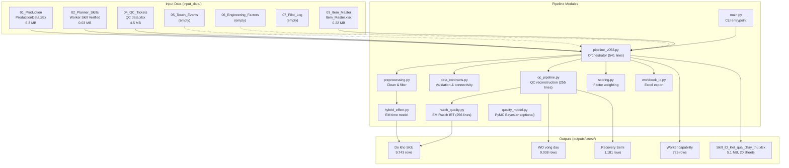
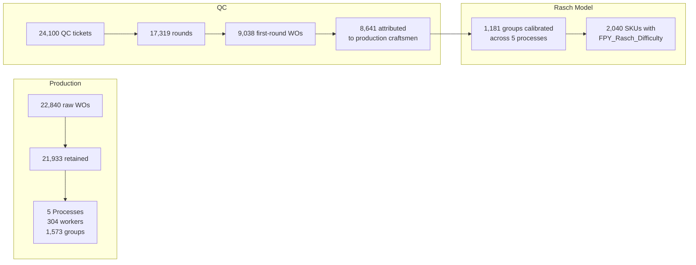

> Historical implementation snapshot. For the current runner, reporting contract, and verified behavior, see [RUN_OPERATIONS.md](RUN_OPERATIONS.md). Numerical results below belong to older runs.

# Skill ID Project — Current State & Implementation Plan

**Spec version:** 0.5.3-pilot.1  
**Pipeline version:** `pipeline_v053.py` (541 lines)  
**Last pipeline run:** 2026-09-14  
**Retained production rows:** 21,933  
**Unit tests:** 24/24 passing  

---

## Architecture Overview



---

## Implementation Status Matrix

### ✅ Fully Implemented & Operational

| # | Feature | Spec § | Module | Key Metrics |
|:--|:--------|:-------|:-------|:------------|
| 1 | **Folder-based incremental ingestion** | §5 | [pipeline_v053.py](file:///d:/Manufacturing%20Data%20Analysis/Skill%20ID%20project/pipeline/pipeline_v053.py#L40-L136) | Auto-discovers files, skips lock files (`~$`), SHA-256 hashes in manifest |
| 2 | **MES multi-sheet production data** | §5.1 | [pipeline_v053.py](file:///d:/Manufacturing%20Data%20Analysis/Skill%20ID%20project/pipeline/pipeline_v053.py#L61-L121) | `GSWorkerWorkingHours` → worker hours, `Qty Doing` proportional allocation |
| 3 | **Production data cleaning** | §3.2 | [preprocessing.py](file:///d:/Manufacturing%20Data%20Analysis/Skill%20ID%20project/pipeline/preprocessing.py) | Excludes Training, `incomplete_month`, computes `log_time` |
| 4 | **Item Master consolidation** | §5 | [pipeline_v053.py](file:///d:/Manufacturing%20Data%20Analysis/Skill%20ID%20project/pipeline/pipeline_v053.py#L173-L284) | Size Adjusted grouping, prefix-based process heuristics |
| 5 | **Bipartite connectivity diagnostics** | §12 | [data_contracts.py](file:///d:/Manufacturing%20Data%20Analysis/Skill%20ID%20project/pipeline/data_contracts.py#L90-L124) | Union-find components, anchor detection (skill ≈ 5), WeakNetwork flagging |
| 6 | **Chronological train/test split** | §15 | [data_contracts.py](file:///d:/Manufacturing%20Data%20Analysis/Skill%20ID%20project/pipeline/data_contracts.py#L69-L87) | WO lifecycle embargo prevents leakage |
| 7 | **Aggregate time diagnostic (EM)** | §9, §27 | [hybrid_effect.py](file:///d:/Manufacturing%20Data%20Analysis/Skill%20ID%20project/pipeline/hybrid_effect.py) | Gaussian random-worker / fixed-group, Duan smearing, 5 processes |
| 8 | **QC ticket reconstruction** | §8 | [qc_pipeline.py](file:///d:/Manufacturing%20Data%20Analysis/Skill%20ID%20project/pipeline/qc_pipeline.py#L15-L156) | Cumulative snapshots → discrete rounds, July exclusion, quantity reconciliation |
| 9 | **First-round FPY computation** | §8 | [qc_pipeline.py](file:///d:/Manufacturing%20Data%20Analysis/Skill%20ID%20project/pipeline/qc_pipeline.py) | 9,038 WOs, FPY per Process×Group |
| 10 | **Production craftsman attribution** | §14 | [pipeline_v053.py](file:///d:/Manufacturing%20Data%20Analysis/Skill%20ID%20project/pipeline/pipeline_v053.py#L436-L458) | Links QC WOs to primary craftsman (most hours), 8,641/9,038 attributed |
| 11 | **Fast analytical Rasch IRT (FPY)** | §9.1, §13 | [rasch_quality.py](file:///d:/Manufacturing%20Data%20Analysis/Skill%20ID%20project/pipeline/rasch_quality.py#L23-L222) | EM/IRLS, all 5 processes converge, 1,181 groups calibrated, **2,040 SKUs** |
| 12 | **Rasch rework diagnostic** | §9.1 | [rasch_quality.py](file:///d:/Manufacturing%20Data%20Analysis/Skill%20ID%20project/pipeline/rasch_quality.py#L224-L256) | Round-level effects for rounds ≥ 2 |
| 13 | **Observed Recovery trajectories** | §17, §18 | [qc_pipeline.py](file:///d:/Manufacturing%20Data%20Analysis/Skill%20ID%20project/pipeline/qc_pipeline.py#L159-L218) | Decay weights (R2=1.0, R3=0.65, R4=0.30), optimistic/pessimistic bounds |
| 14 | **Touch event reconstruction** | §17.2 | [qc_pipeline.py](file:///d:/Manufacturing%20Data%20Analysis/Skill%20ID%20project/pipeline/qc_pipeline.py#L221-L255) | Overnight idle filtering, SelfRework vs AssistedRescue taxonomy |
| 15 | **Engineering factor gate check** | §23, §25 | [scoring.py](file:///d:/Manufacturing%20Data%20Analysis/Skill%20ID%20project/pipeline/scoring.py) | 5-factor validation; missing factor → missing Final Complexity |
| 16 | **Excel workbook export** | §38 | [workbook_io.py](file:///d:/Manufacturing%20Data%20Analysis/Skill%20ID%20project/pipeline/workbook_io.py) | 20 styled sheets, formula injection guard, PermissionError fallback |
| 17 | **Model validation & metrics** | §35 | [validation.py](file:///d:/Manufacturing%20Data%20Analysis/Skill%20ID%20project/pipeline/validation.py) + [evaluation.py](file:///d:/Manufacturing%20Data%20Analysis/Skill%20ID%20project/pipeline/evaluation.py) | Holdout RMSE/MAE/WAPE, Planner correlation (Pearson/Kendall/Spearman) |
| 18 | **Bayesian quality candidates** | §9.2–9.4 | [quality_model.py](file:///d:/Manufacturing%20Data%20Analysis/Skill%20ID%20project/pipeline/quality_model.py) + [quality_candidates.py](file:///d:/Manufacturing%20Data%20Analysis/Skill%20ID%20project/pipeline/quality_candidates.py) | Beta-Binomial vs WO-RE GLMM comparison (PyMC, optional) |
| 19 | **24 automated unit tests** | §39 | [test_pipeline.py](file:///d:/Manufacturing%20Data%20Analysis/Skill%20ID%20project/tests/test_pipeline.py) | All passing in 4.0s |

---

### 🟡 Implemented But Gated / Diagnostic Only

| # | Feature | Status | Reason Blocked |
|:--|:--------|:-------|:---------------|
| 1 | **QualityDifficulty (0.8×FPY + 0.2×Recovery)** | `NaN` in output | Recovery weighting (80/20) not calibrated against holdout (§21.3) |
| 2 | **Final Technical Complexity** | `NaN` in output | Requires all 5 Engineering factors approved for each SKU (§25) |
| 3 | **Stone Setting time model** | `Did not converge` | Insufficient cross-worker observations in Stone Setting process |

---

### 🔴 Not Yet Implemented (Spec Requirements)

| # | Feature | Spec § | Blocking Gate | Difficulty |
|:--|:--------|:-------|:--------------|:-----------|
| 1 | **Scrap tracking & terminal disposition** | §6, §19 | MES software in development | External dependency |
| 2 | **Worker–Semi matching recommendation engine** | §26 | Requires calibrated Quality + Touch Time + Confidence Tiers + Capacity | Large |
| 3 | **Decontaminated clean touch-time model ($T_{\text{first}}$)** | §17.2, §27.2 | Touch Events input data not yet collected from factory scanners | External dependency |
| 4 | **Effective-dated historical Planner skill workflow** | §5.4, §11 | Only single static snapshot available | Medium |
| 5 | **Pilot power analysis & sample size** | §31, §36, B8 | Requires ICC from lead-in observation phase | Medium |
| 6 | **Dynamic worker skill tracking** | §28 | Future enhancement (Kalman/EWMA/Glicko) | Future |
| 7 | **Cold-start Semi prediction** | §29 | Future enhancement (hierarchical BOM priors) | Future |
| 8 | **Defect code / severity weighting** | §30 | Out of current pilot scope | Future |

---

## Current Pipeline Output Summary

### `Do kho SKU.csv` — 9,743 SKU-Process Rows

| Column | Non-null | Source |
|:-------|:---------|:-------|
| `Aggregate Time Group Effect` | 9,743 | `hybrid_effect.py` EM model |
| `Estimated aggregate minutes per final OK` | 9,743 | Duan smearing transform |
| `ConnectivityStatus` | 9,743 | `data_contracts.connectivity` |
| `ObservedFPY` | 2,040 | `qc_pipeline.reconstruct_qc` |
| `FPY_Raw_Difficulty` | 2,040 | $10 \times (1 - \text{FPY})$ |
| `FPY_Rasch_Difficulty` | **2,040** | `rasch_quality.fit_rasch_quality` |
| `QualityDifficulty` | **0** | Blocked: Recovery weighting not calibrated |
| `Final Technical Complexity` | **0** | Blocked: Engineering factors not approved |

### Quality Status Distribution

| Status | Count |
|:-------|------:|
| Rasch IRT calibrated; assignment-conditional | 2,040 |
| Insufficient Evidence: no eligible QC | 7,703 |

### Go Live Gates

| Gate | Status |
|:-----|:-------|
| Aggregate time diagnostic | ✅ Available |
| QC reconstruction | ✅ Available |
| Quality model calibration | 🔴 Not validated |
| Planner history | 🔴 Not verified |
| Clean touch-time model | 🔴 Not validated |
| Recovery weighting | 🔴 Not calibrated |
| Engineering factors | 🔴 Pending validation |
| Matching | 🔴 Unavailable |
| Scrap | 🔴 InDevelopment |
| Pilot approval | 🔴 Pending |

---

## Key Data Flow Statistics



### Rasch IRT Convergence Results

| Process | WOs | Workers | Groups | Converged | Iterations |
|:--------|----:|--------:|-------:|:---------:|-----------:|
| Bright Cut | 494 | 43 | 54 | ✅ | 224 |
| Polishing | 2,787 | 84 | 348 | ✅ | 272 |
| Sanding | 3,893 | 188 | 469 | ✅ | 523 |
| Soldering | 898 | 50 | 47 | ✅ | 348 |
| Stone Setting | 965 | 56 | 263 | ✅ | 232 |

---

## File Structure

```
Skill ID project/
├── pipeline/
│   ├── __init__.py
│   ├── main.py                    # CLI entrypoint (26 lines)
│   ├── config.py                  # Immutable Config dataclass (76 lines)
│   ├── pipeline_v053.py           # Main orchestrator (541 lines)
│   ├── data_contracts.py          # Validation, connectivity (125 lines)
│   ├── preprocessing.py           # Clean production & planner (63 lines)
│   ├── hybrid_effect.py           # EM Gaussian time model (77 lines)
│   ├── rasch_quality.py           # EM IRLS Rasch IRT model (256 lines)
│   ├── qc_pipeline.py             # QC reconstruction & recovery (255 lines)
│   ├── scoring.py                 # Factor weighting & confidence (46 lines)
│   ├── quality_model.py           # PyMC Bayesian GLMM (152 lines)
│   ├── quality_candidates.py      # Bayesian model comparison (83 lines)
│   ├── validation.py              # Cross-validation utilities (119 lines)
│   ├── evaluation.py              # Metrics & Planner comparison (158 lines)
│   ├── workbook_io.py             # Excel export engine (67 lines)
│   ├── audit_bom_features.py      # BOM audit utilities (80 lines)
│   ├── bom_features.py            # BOM feature extraction (222 lines)
│   ├── create_folder_templates.py # Input folder scaffolding (87 lines)
│   ├── create_template.py         # Excel template generator (173 lines)
│   └── qc_disposition.py          # QC disposition mapping (73 lines)
├── tests/
│   ├── test_pipeline.py           # 24 unit tests (285 lines)
│   └── test_bom_features.py       # BOM feature tests (78 lines)
├── input_data/
│   ├── 01_Production/ProductionData.xlsx          (6.3 MB)
│   ├── 02_Planner_Skills/Worker Skill...xlsx      (0.03 MB)
│   ├── 04_QC_Tickets/QC data.xlsx                 (4.5 MB)
│   ├── 05_Touch_Events/                           (empty - awaiting factory)
│   ├── 06_Engineering_Factors/                    (empty - awaiting approval)
│   ├── 07_Pilot_Log/                              (empty - pilot not started)
│   └── 09_Item_Master/Item_Master.xlsx            (0.22 MB)
├── outputs/latest/
│   ├── Skill_ID_Ket_qua_chay_thu.xlsx             (5.1 MB)
│   ├── Do kho SKU.csv, Worker capability.csv, ...  (22 CSV files)
│   ├── run_manifest.json, time_models.json
│   └── Go Live Gates.csv
├── docs/
│   ├── Skill_ID_Project_Specification_v0.5.3.md   (2,020 lines)
│   └── VALIDATION_REPORT.md
└── archive/legacy_code/
    └── legacy_main.py, bayesian_model.py, ...
```

---

## Known Issues & Methodological Notes

> [!IMPORTANT]
> **Worker Skill Baseline Policy (Locked Decision)**: Worker Skill verification performed on 2026-08-03 serves as the official baseline skill inventory. Because no prior historical skill time-series exists before this date, the 2026-08-03 verified skill levels apply retrospectively to all work orders and craftsmen prior to 2026-08-03. In WO vong dau, 7,718 work orders have their allocated craftsman's Planner Verified Skill Level directly attached.

> [!WARNING]
> **Rasch variance attenuation**: `rasch_quality.py` M-step uses $\tau_w^2 = \text{mean}(u^2)$ without adding posterior variance. This causes slight underestimation of shrinkage variances compared to `hybrid_effect.py` (which correctly accounts for posterior uncertainty). Non-blocking for pilot diagnostics.

> [!NOTE]  
> **Assignment-conditional interpretation**: All quality difficulty scores are labeled "assignment-conditional" because historical worker-to-item assignment is non-random (§14). Scores reflect observed difficulty given the workers who happened to work each item, not intrinsic item difficulty.

> [!NOTE]
> **Stone Setting time model**: Did not converge during EM fitting. Scores remain diagnostic but are still published with a warning flag.

> [!NOTE]
> **Recovery weighting (80/20 FPY/Recovery)**: The specification's proposed weighting has not been calibrated against holdout manufacturing cost data. `QualityDifficulty` remains deliberately `NaN` until calibration is completed (§21.3).
